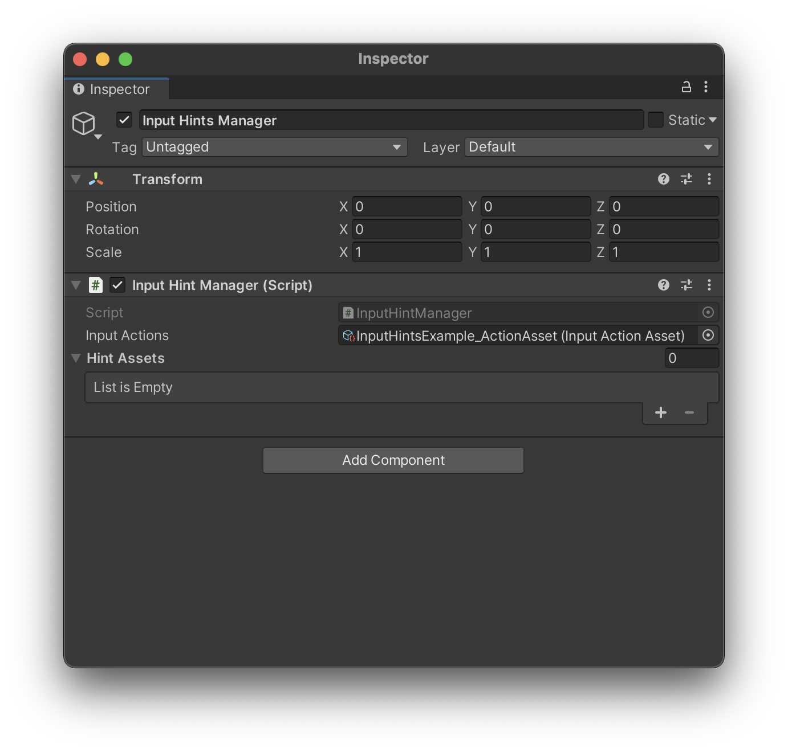
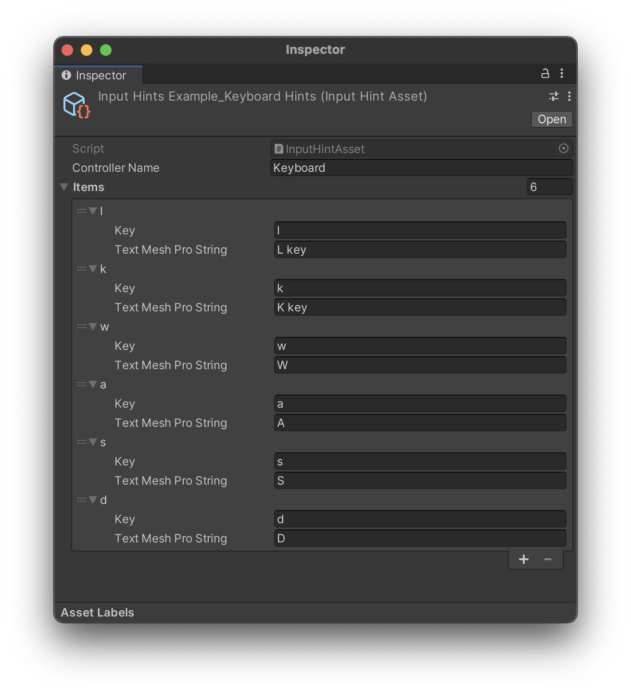
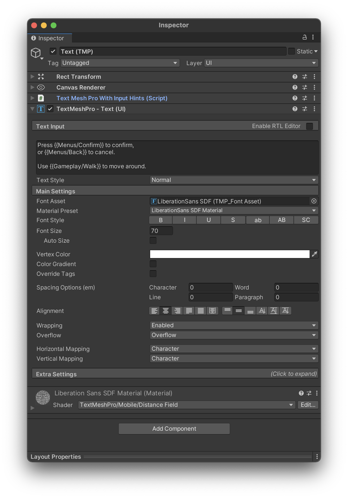

# InputHints
This library aims to make it much easier to implement control scheme-specific input hints into a Unity project. It works best with controllers (i.e. when there's no composite inputs) but attempts to resolve composite inputs as well.

**IMPORTANT NOTE:** This library is still in its infancy as I figure out how to work the new Input System. There are some issues and limitations it has that I haven't been able to figure out yet:
* There isn't great support for composite controls (like WASD). Currently, it should simply try to break up a composite into its component parts, and parse each of those separately.
* There is *some* error handling for when a controller or button name can't be resolved, but it needs some improving.

## Example usage
Say you have an Action Map titled "Menus", and within that, an action named "Confirm". You'd like to have text in your game that says "Press A to Confirm" when using an Xbox controller, and "Press Enter to Confirm" when using a keyboard. To do this, you would simply have a TextMeshPro component with the text:
```
Press {{Menus/Confirm}} to Confirm
```
See the instructions below for getting the system set up.

## Setting up
### Configuring the Input Hint Manager
Add the "Input Hint Manager" component to a Game Object in your Scene, and drop your Input Action Asset into the "Input Actions" slot of the Input Hint Manager.



### Creating an Input Hint Asset
**Input Hint Assets** store input hints; for example, they may map the "Cross" button on a DualShock controller to a TextMeshPro sprite of that button.

To create a new Input Hint Asset, navigate to "Create -> Input Hints -> Input Hint Asset" in the Project tab.

Set the *Name* field in the new Input Hint Asset to the name of the controller you want to include input hints for.

Set the length of *Items* to the number of input hints you'd like for this controller. Each item within the *Items* list relates a single input to a display string.
* **Key** - This is the Display Name of this input as shown in the Input Debugger*.
* **Text Mesh Pro String** - This string will replace instances of the Key, when encountered.



Add each Input Hint Asset you create to the Input Hint Manager component.

#### ***IMPORTANT NOTE**
You can *usually* find the key and controller name values in the Input Debugger, under "Display Name". However, the names that Unity gives when running a game sometimes differ from these values, so it's important to test. InputHints will tell you in the Console if it can't find a key or controller name that corresponds to an action - you can use this information to correctly set your key and controller name values.


### Displaying Hints in a TextMeshPro Object
Attach the "Text Mesh Pro With Input Hints" component to all GameObjects with TextMeshPro components that you would like to have button hints on.

